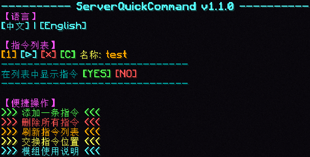

# QuickCommand - 快捷指令
**中文** **|** [**English**](README_en.md)

这是一个用于在游戏中快速、连续地执行多条任意指令的模组，该模组所有的指令都可以在聊天框中点击对应按钮来执行。
它可以作为一个服务端模组提供所有玩家共享的快捷指令，服务端安装后，您只需要使用/serverQuickCommand命令即可控制服务端的快捷指令，配置文件储存在服务器存档文件夹中。

---

# 快捷键

集成了一个快捷键用来快速打开聊天框中的界面，默认为 `U` ，您可以在游戏设置中对其进行更改。

# 指令

- **/quickCommand**
  - 打开快捷指令列表。
- **/quickCommand add <name> <command>**
  - 添加一条名为<name>指令为<command>的快捷指令。
  - 例：/quickCommand add "执行/seed指令" "/seed" 
    - 添加执行/seed的快捷指令。
- **/quickCommand remove <name>**
  - 删除名为<name>的快捷指令。
  - 例：/quickCommand remove "执行/seed指令"
    - 删除名为"执行/seed指令的快捷指令"
- **/quickCommand removeAll**
  - 删除所有快捷指令。
- **/quickCommand removeAll confirm**
  - 二次确认是否删除所有快捷指令。
- **/quickCommand listWithRun**
  - 打开快捷指令列表。
- **/quickCommand swap <index1> <index2>**
  - 调换序号<index1>与序号<index2>在列表中的显示位置。
- **/quickCommand displayCommandInList <true/false>**
  - 是否在列表中显示指令。
- **/quickCommand language <en_us/zh_cn>**
  - 设置语言。
- **/quickCommand help**
  - 查看模组使用说明。
