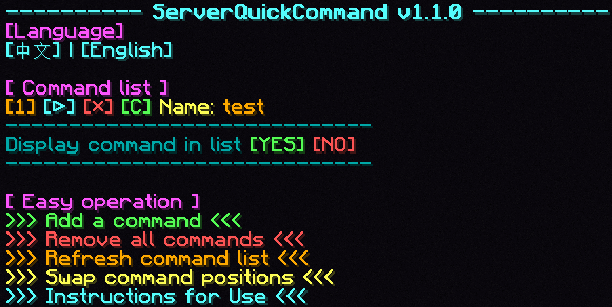

# QuickCommand
[**中文**](README.md) **|** **[English]**

This is a mod for quickly and consecutively executing multiple arbitrary commands in the game. All commands can be executed by clicking the corresponding buttons in the chat box. 
It can serve as a server mod to provide shared quick commands for all players. Once installed on the server, you only need to use the /serverQuickCommand command to control the server's quick commands. The configuration files are stored in the server's save folder.

---

# Short Key

Integrated a shortcut key to quickly open the interface in the chat box, defaulting to `U`, which can be changed in the game settings.

# Commands

- **/quickCommand**
  - Open the quick command list.
- **/quickCommand add &lt;name&gt; &lt;command&gt;**
  - Add a quick command named &lt;name&gt; with command &lt;command&gt;.
  - Example: /quickCommand add "Execute /seed" "/seed"
    - Add a quick command to execute /seed.
- **/quickCommand remove &lt;name&gt;**
  - Remove the quick command named &lt;name&gt;.
  - Example: /quickCommand remove "Execute /seed"
    - Remove the quick command named \"execute /seed command\".
- **/quickCommand removeAll**
  - Remove all quick commands.
- **/quickCommand removeAll confirm**
  - Confirm to remove all quick commands.
- **/quickCommand listWithRun**
  - Open the quick command list.
- **/quickCommand swap &lt;index1&gt; &lt;index2&gt;**
  - Swap the display positions of &lt;index1&gt; and &lt;index2&gt; in the list.
- **/quickCommand displayCommandInList &lt;true/false&gt;**
  - Whether to display commands in the list.
- **/quickCommand language [en_us/zh_cn]**
  - Set language.
- **/quickCommand help**
  - View the mod usage instructions.
